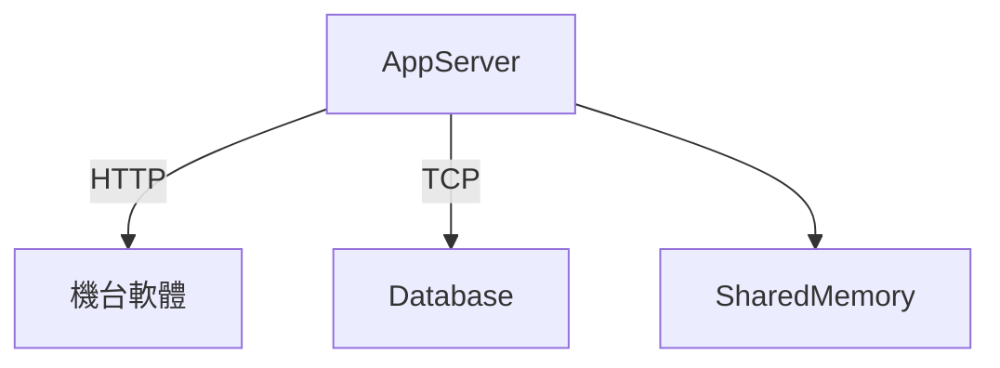

# AppServer新需求

## 🔥 架構



---

## 🔥 Event

### 🔶 啟動時

- 由 DB 載入「是否啟用 App 配對」的旗標，並清除所有配對資料

### 🔶 App 註冊配料時

- 將配料資料寫入 DB

### 🔶 App 註銷配料時

- 將配料資料從 DB 移除

---

## 🔥 Api

### 🔶 設定是否啟用 App 配對

```http
POST {{url}}/api/enableAppPairing
Authorization: Bearer {{token}}
Content-Type: application/json

{
  "enable": true
}
```

### 🔶 機台軟體呼叫註冊配料

```http
POST {{url}}/api/registerAssmebly
Authorization: Bearer {{token}}
Content-Type: application/json

{
  "matchMaterial": [boolean], // 是否比對材質
  "insert": [boolean], // 是否插入對列前端(優先處理)
  "data": [
    {
      "id": [string], // ID
      "material": [string], // 材質
      "materialNumber": [string], // 素材編號
      "profile": [string], // 斷面規格
      "smeltingNumber": [string], // 爐號
      "source": [string], // 廠商
      "length": [string] // 長度
    },
    {
      "id": [string], // ID
      "material": [string], // 材質
      "materialNumber": [string], // 素材編號
      "profile": [string], // 斷面規格
      "smeltingNumber": [string], // 爐號
      "source": [string], // 廠商
      "length": [string] // 長度
    }
  ]
}
```

### 🔶 機台軟體呼叫註銷配料

```http
POST {{url}}/api/unregisterAssmebly
Authorization: Bearer {{token}}
Content-Type: application/json

{
  "idList": [array<string>] // 要註銷的ID
}
```

### 🔶 查詢是否啟用 App 配對

```http
GET {{url}}/api/getEnableAppPairing
Authorization: Bearer {{token}}
```

### 🔶 輪詢 App 配料資料

```http
GET {{url}}/api/getAppPairingData
Authorization: Bearer {{token}}
```
