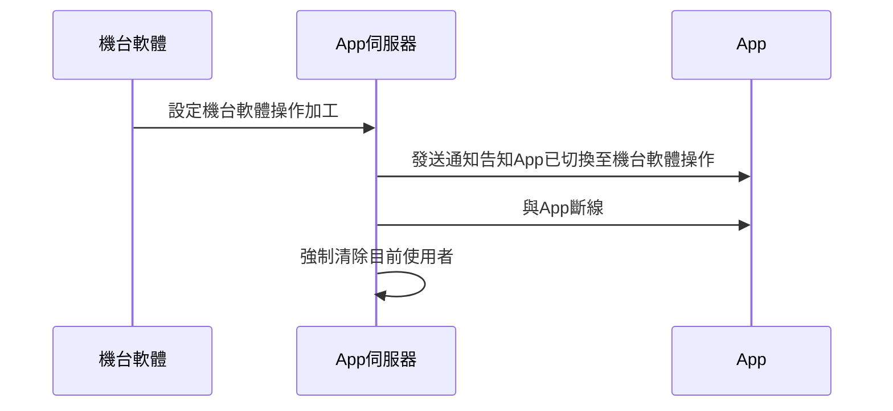
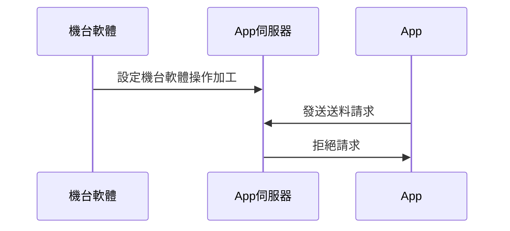
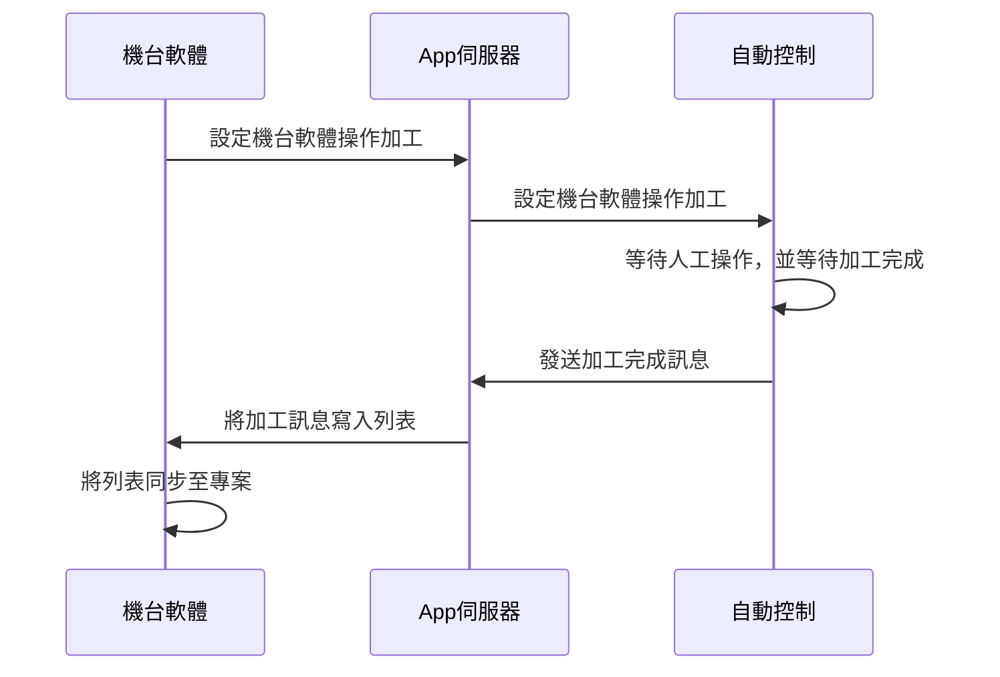
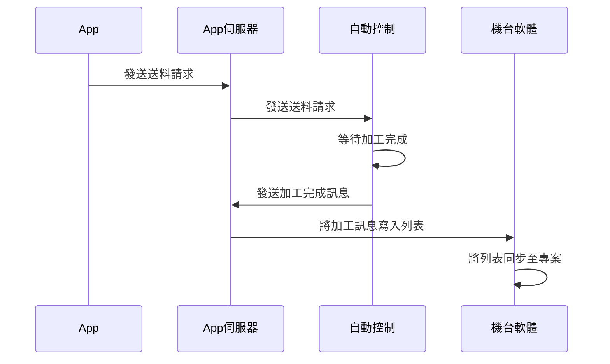

# App與機台軟體互動

- Lv1
  - 橫移料架
  - 輸送料架
  - 送料手臂
- Lv2
  - 手機 App
  - 機台軟體
- Lv3
  - 打點 (不列入最終進度，即可做可不做)
  - 鑽孔 (需做完)

## 🔥 設定機台軟體操作加工

## 🔥 設定機台軟體操作時，App 斷線前嘗試操作

## 🔥 設定機台軟體操作時，機台軟體發送送料請求

## 🔥 設定 App 操作時，App 發送送料請求

如何知道機台已操作完成？
