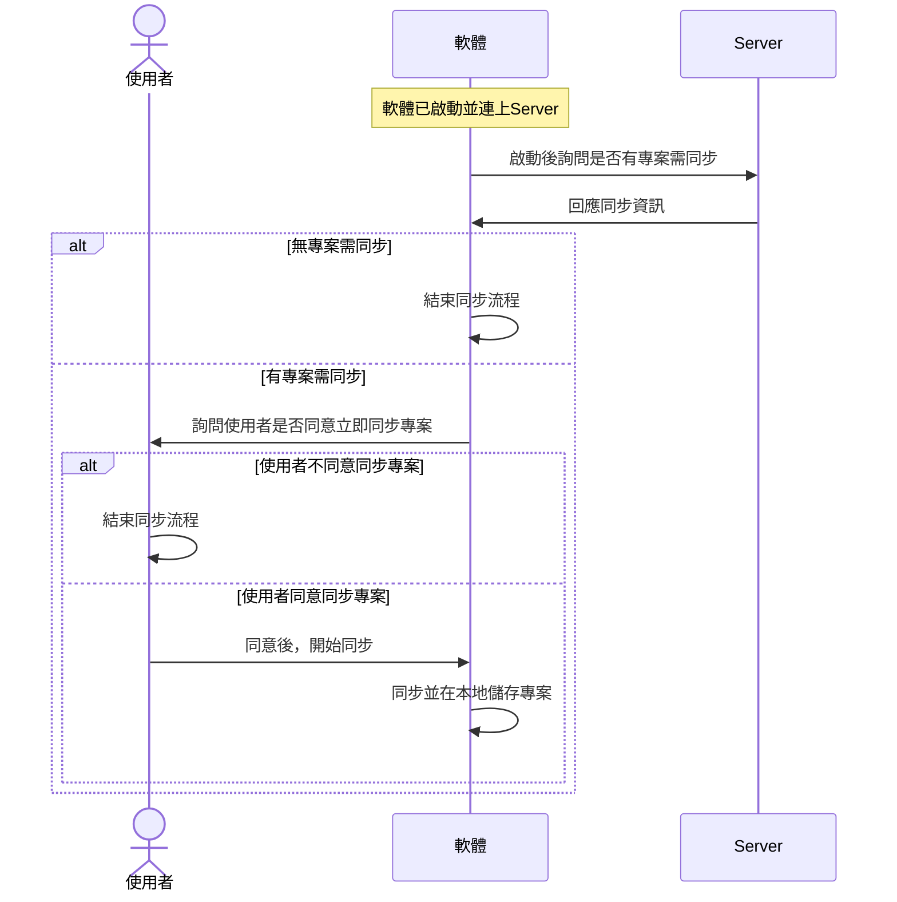
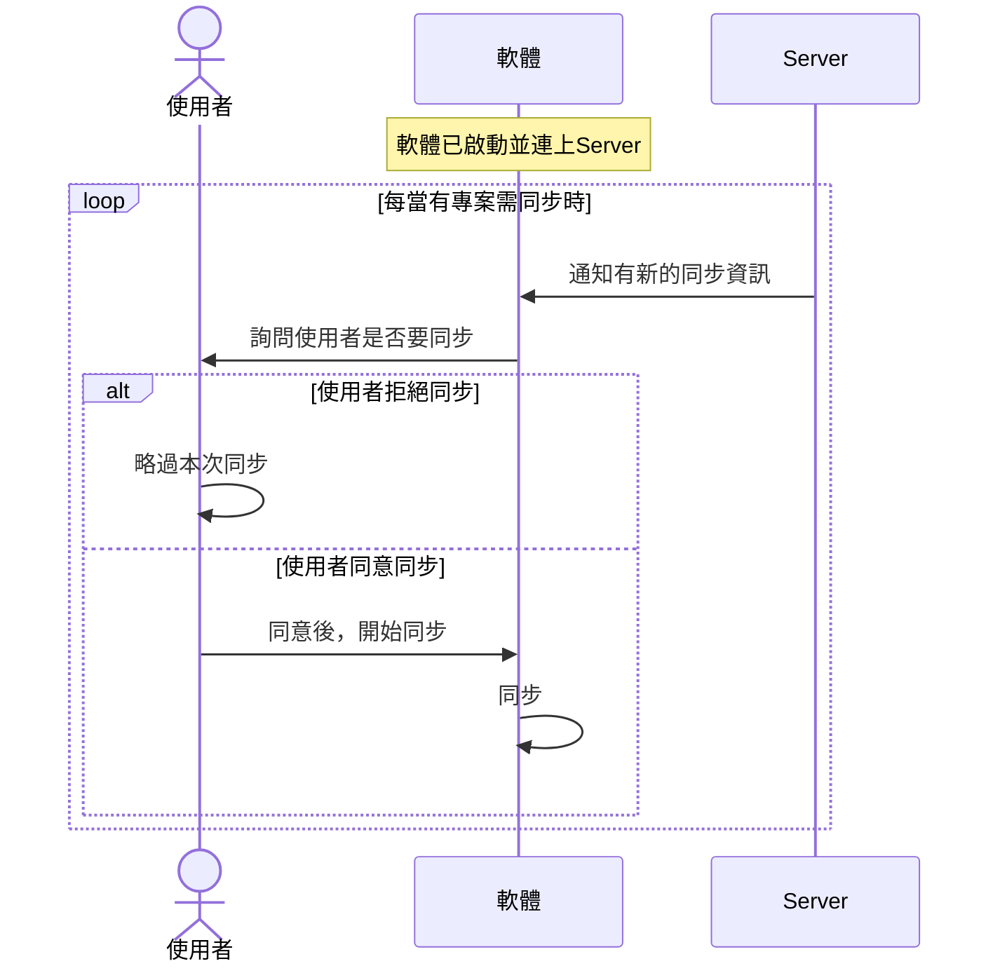
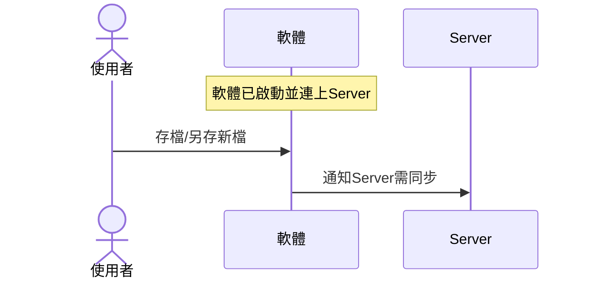
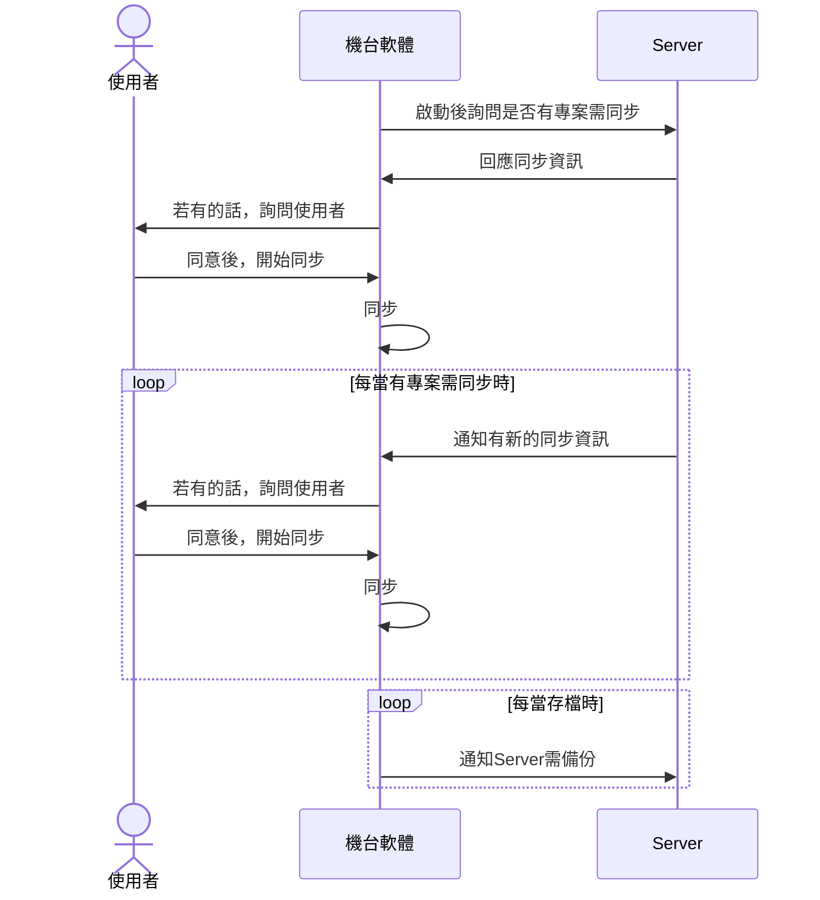
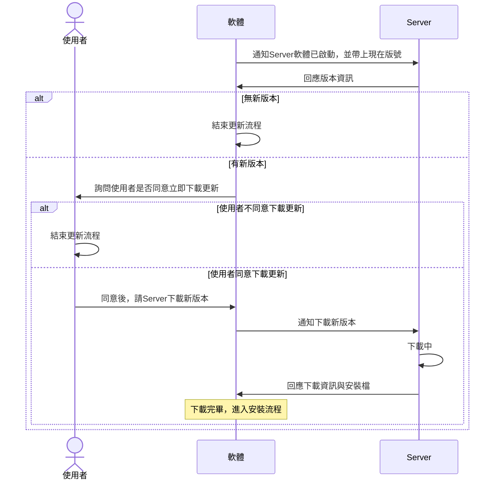
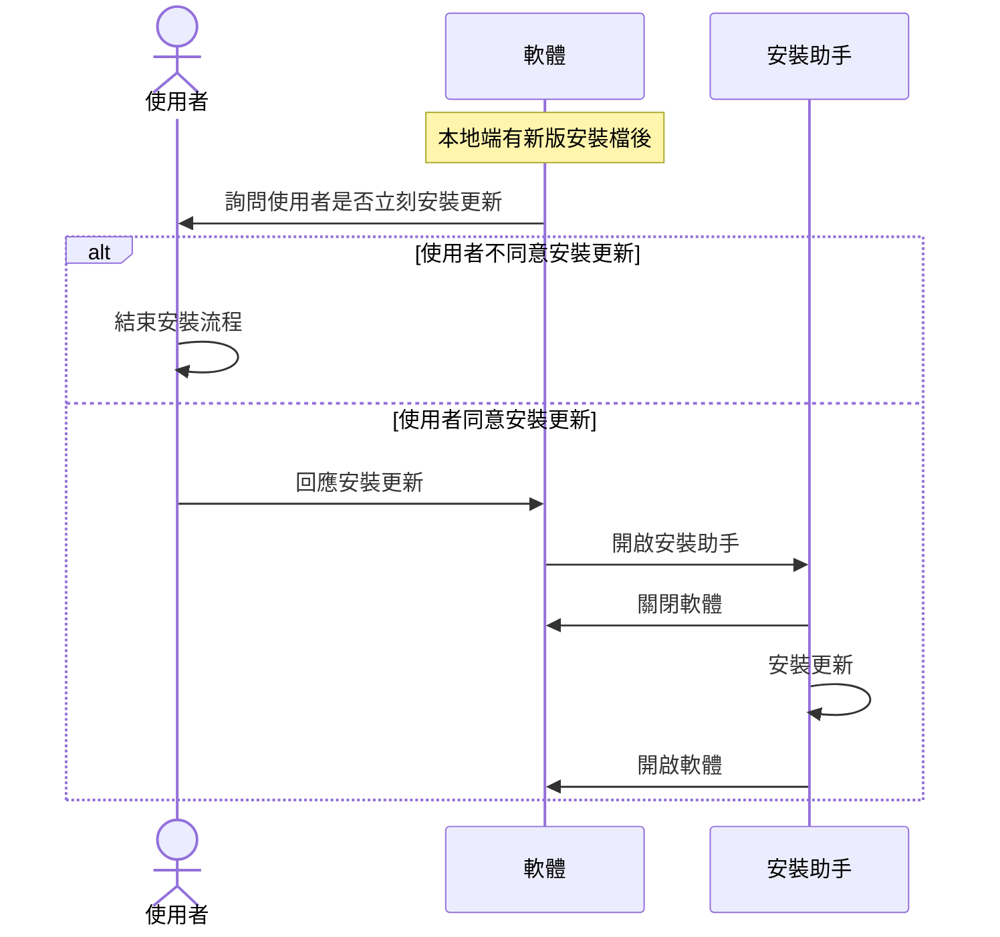
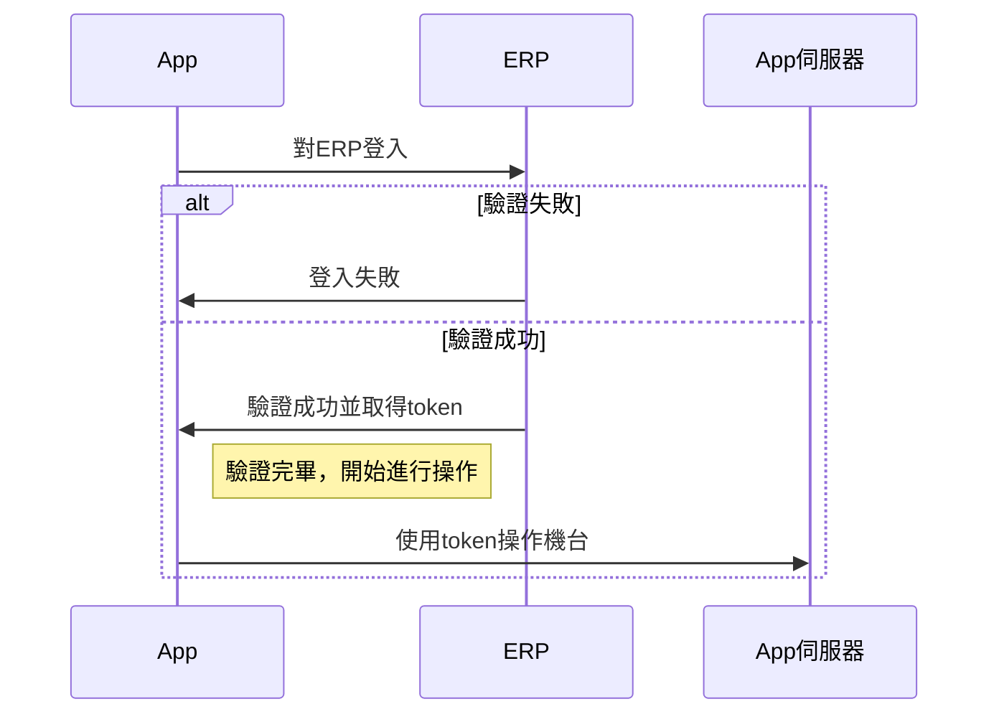
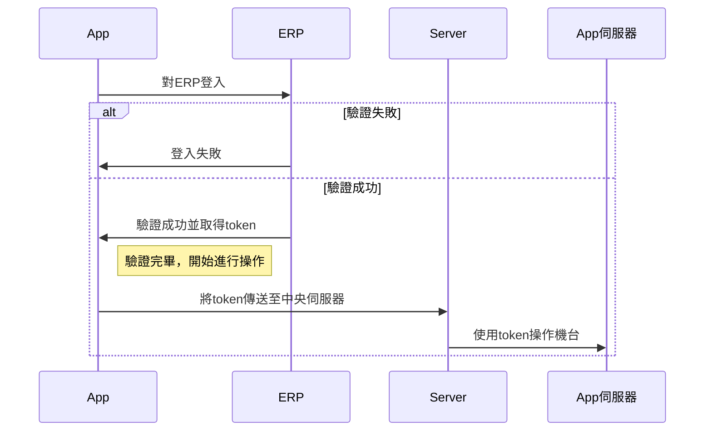
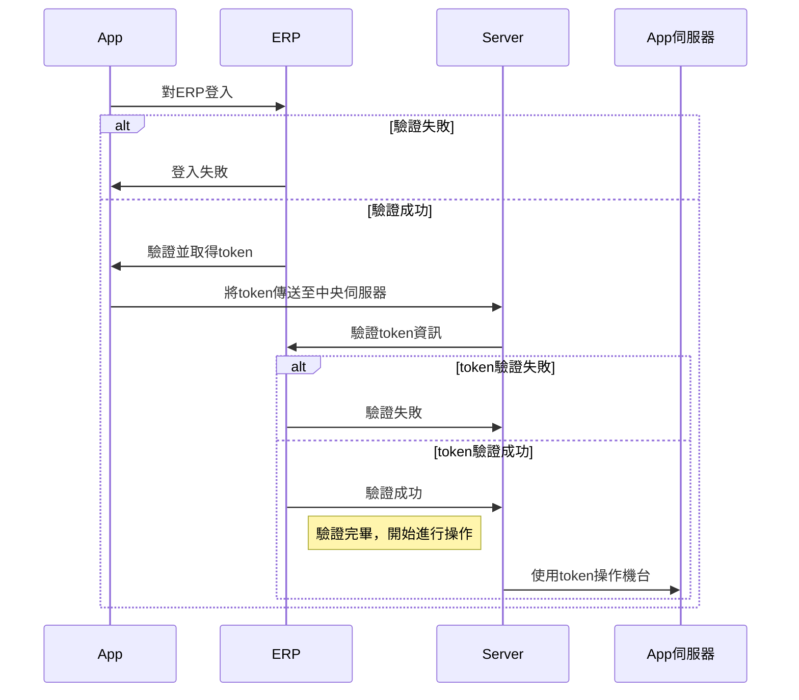

# 流程圖

# 軟體專案同步

## 🔥 軟體啟動時

---

## 🔥 軟體收到同步資訊時

---

## 🔥 軟體存檔時

---

## 🔥 機台軟體專案同步

# 軟體更新流程

## 🔥 軟體更新流程

---

## 🔥 軟體安裝流程

# 軟體登入流程

## 🔥 單機軟體登入

---

## 🔥 機聯網(內網)軟體登入

---

## 🔥 機聯網(外網)軟體登入

