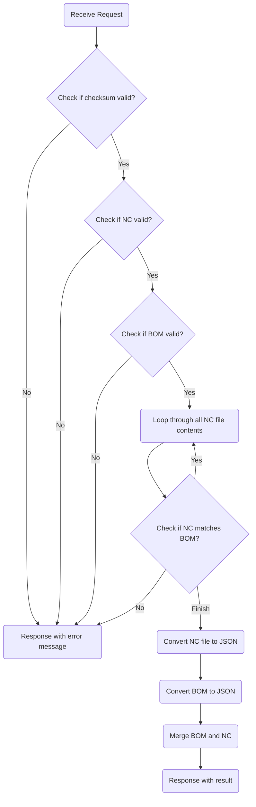

# 轉檔Server

## 🔥 用途

作為轉檔的微服務，將來自 Tekla 的 Bom 表與 NC 檔的資料，或自行開發的 XML 文件，轉換成相對應的格式。

## 🔥 Api

### 🔶 Request Sample

```http
POST /api/convertBomAndNc
Authorization: Bearer <token>
Content-Type: application/json

{
  "bom_content": "string",
  "nc_content": [
    "string"
  ]
}
```

### 🔶 Response Sample

```http
{
  "assmeblys": [
    {
      "id": "string",
      "name": "string",
      "count": 10,
      "parts": [
        {
          "id": "string",
          "name": "string",
          "count": 10,
          "specification": "string",
          "length": 1000,
          "material": "string",
          "ac": "string",
          "bo": "string",
        }
      ]
    }
  ]
}
```

### 🔶 Request Body

| name        | type       | desc                      |
| ----------- | ---------- | ------------------------- |
| bom_content | `string`   | BOM 表內容                |
| nc_content  | `string[]` | NC 檔內容，為一個字串陣列 |

### 🔶 Response Body

| name      | type         | desc     |
| --------- | ------------ | -------- |
| assmeblys | `Assmebly[]` | 構建陣列 |

### 🔶 Assmebly

| name  | type     | desc     |
| ----- | -------- | -------- |
| id    | `string` | GUID     |
| name  | `string` | 構建編號 |
| count | `number` | 構建數量 |
| parts | `Part[]` | 零件陣列 |

### 🔶 Part

| name          | type      | desc       |
| ------------- | --------- | ---------- |
| id            | `string`  | GUID       |
| name          | `string`  | 零件編號   |
| count         | `number`  | 零件數量   |
| specification | `string`  | 斷面規格   |
| length        | `number`  | 長度       |
| material      | `string`  | 材質       |
| ac            | `string?` | 外輪廓描述 |
| bo            | `string?` | 孔群描述   |

## 🔥 Api Flow


