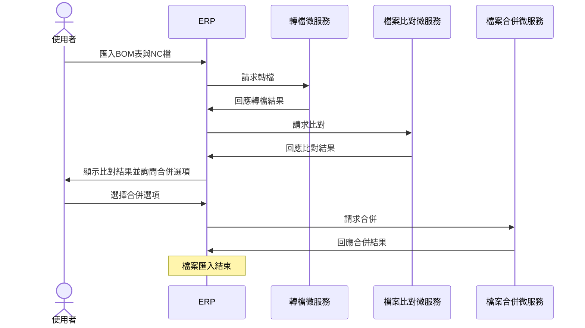
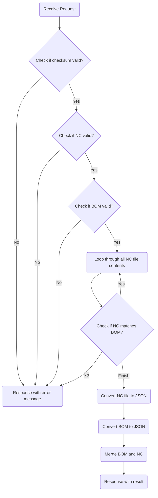

# 轉檔Server

# 流程

## 🔥 BOM 表與 NC 檔匯入流程




# 轉檔

## 🔥 用途

作為轉檔的微服務，將來自 Tekla 的 Bom 表與 NC 檔的資料，或自行開發的 XML 文件，轉換成相對應的格式。

## 🔥 Api

### 🔶 Request Sample

```http
POST /api/projectConvertFromBomAndNc
Authorization: Bearer <token>
Content-Type: application/json

{
  "bomContent": string,
  "ncContent": Array<string>
}
```

### 🔶 Response Sample

```http
{
  "assemblyTemplates": [
    {
      "name": string,
      "partTemplates: [
        {
          "name": string,
          "count": number,
        }
      ]
    }
  ],
  "partTemplates": [
    {
      "name": string,
      "specification": string,
      "length": number,
      "material": string,
      "ac": string?,
      "bo": string?,
    }
  ],
  "assmeblys": [
    {
      "id": "string",
      "name": string,
      "parts": [
        {
          "id": "string",
          "name": string,
        },
        {
          "id": "string",
          "name": string,
        }
      ]
    }
  ]
}
```

### 🔶 Request Body

| name       | type            | desc                      |
| ---------- | --------------- | ------------------------- |
| bomContent | `string`        | BOM 表內容                |
| ncContent  | `Array<string>` | NC 檔內容，為一個字串陣列 |

### 🔶 Response Body

| name              | type                 | desc         |
| ----------------- | -------------------- | ------------ |
| assemblyTemplates | `AssmeblyTemplate[]` | 構件樣板陣列 |
| partTemplates     | `PartTemplate[]`     | 零件樣板陣列 |
| assmeblys         | `Assmebly[]`         | 構件陣列     |

### 🔶 AssmeblyTemplate

| name          | type                                   | desc         |
| ------------- | -------------------------------------- | ------------ |
| name          | `string`                               | 構件編號     |
| partTemplates | `Array<{name: string; count: number}>` | 零件樣板陣列 |

### 🔶 PartTemplate

| name          | type      | desc       |
| ------------- | --------- | ---------- |
| name          | `string`  | 零件編號   |
| specification | `string`  | 斷面規格   |
| length        | `number`  | 長度       |
| material      | `string`  | 材質       |
| ac            | `string?` | 外輪廓描述 |
| bo            | `string?` | 孔群描述   |

### 🔶 Assmebly

| name  | type     | desc     |
| ----- | -------- | -------- |
| id    | `string` | GUID     |
| name  | `string` | 構件編號 |
| parts | `Part[]` | 零件陣列 |

### 🔶 Part

| name | type     | desc     |
| ---- | -------- | -------- |
| id   | `string` | GUID     |
| name | `string` | 零件編號 |

## 🔥 Api Flow




# 檔案比對

## 🔥 用途

比較兩份文件的差異，並將回傳差異的部分。

## 🔥 Api

### 🔶 Request Sample

```http
POST /api/projectDiff
Authorization: Bearer <token>
Content-Type: application/json

{
  "originProject": Project,
  "newProject": Project
}
```

### 🔶 Response Sample

```http
{
  "diffResult": {
    "name1": {
      "type": "new",
      "value": "value"
    },
    "name2": {
      "type": "delete",
      "value": "value"
    },
  }
}
```

### 🔶 Request Body

| name          | type      | desc               |
| ------------- | --------- | ------------------ |
| originProject | `Project` | 原始的廣達專案格式 |
| newProject    | `Project` | 匯入的廣達專案格式 |

### 🔶 Response Body

| name       | type         | desc     |
| ---------- | ------------ | -------- |
| diffResult | `DiffResult` | 比對結果 |

### 🔶 DiffResult

| name      | type                          | desc            |
| --------- | ----------------------------- | --------------- |
| key       | `string`                      | 更動構建或零件  |
| key.type  | `new` \| `change` \| `delete` | 更動類型        |
| key.value | `number` \| `string`          | 更動數量/更動值 |


# 檔案合併

## 🔥 用途

將兩個檔案藉由使用者操作的選項合併成一個檔案

## 🔥 Api

### 🔶 Request Sample

```http
POST /api/projectMerge
Authorization: Bearer <token>
Content-Type: application/json

{
  "originProject": Project,
  "newProject": Project,
  "mergeOptions": MergeOptions
}
```

### 🔶 Response Sample

```http
{
  "resultProject": Project
}
```

### 🔶 Request Body

| name          | type           | desc               |
| ------------- | -------------- | ------------------ |
| originProject | `Project`      | 原始的廣達專案格式 |
| newProject    | `Project`      | 匯入的廣達專案格式 |
| mergeOptions  | `MergeOptions` | 合併選項           |

### 🔶 MergeOptions

| name    | type     | desc           |
| ------- | -------- | -------------- |
| key     | `string` | 更動構建或零件 |
| optrion | `string` | 使用者選項     |

### 🔶 Response Body

| name          | type      | desc               |
| ------------- | --------- | ------------------ |
| resultProject | `Project` | 合併的廣達專案格式 |
