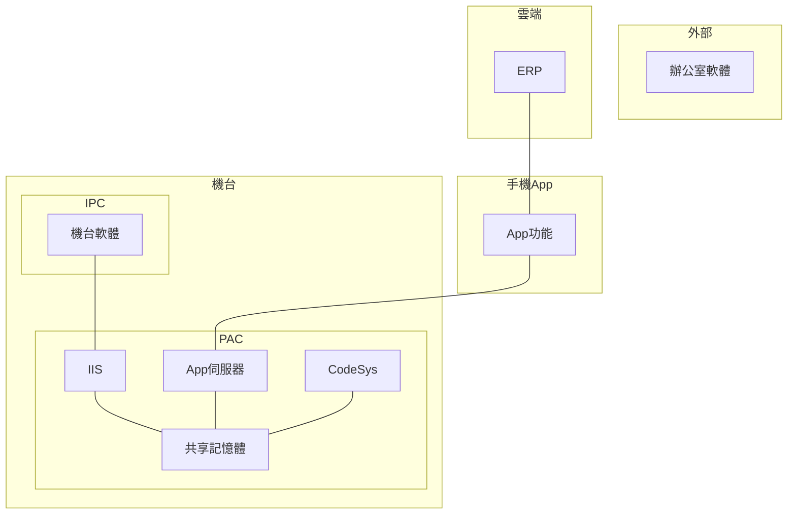
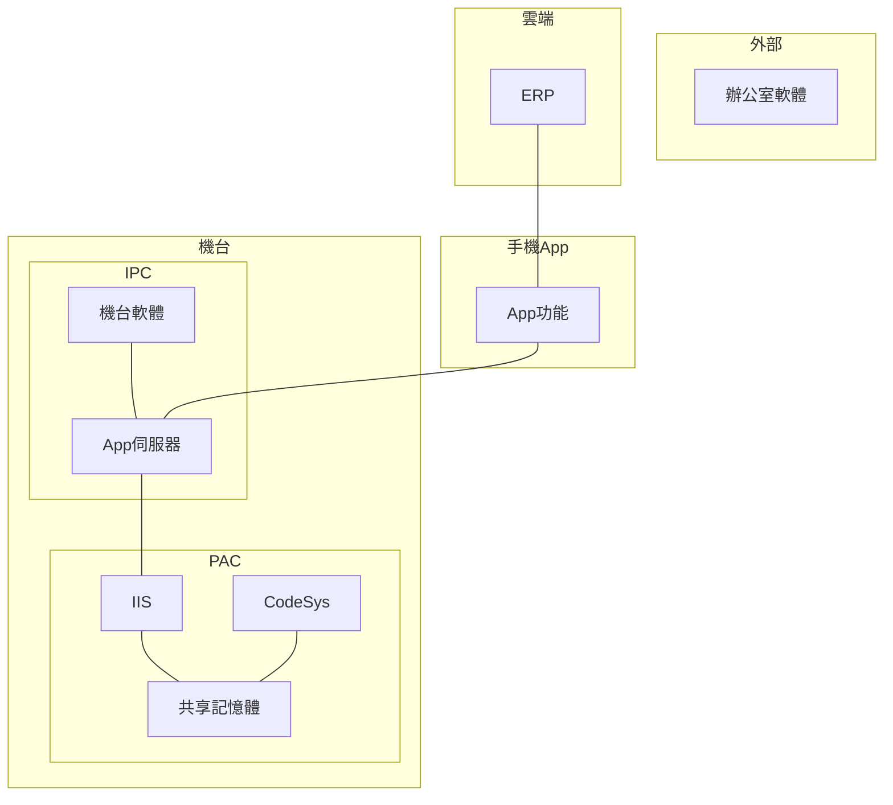
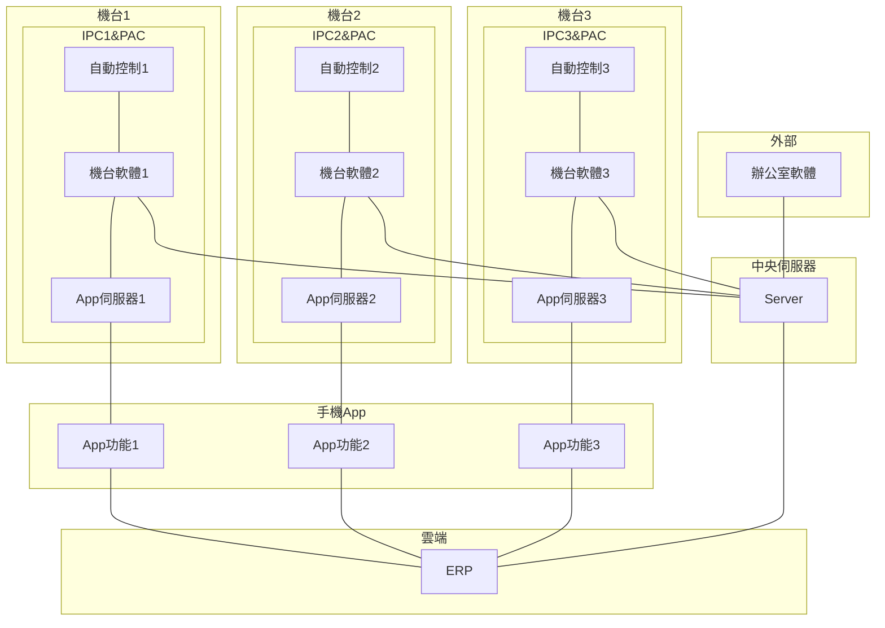

# 系統配置

## 🔥 單機版配置 (現在三軸版本)

```mermaid
flowchart TB
  subgraph 機台
    subgraph PAC
      IIS --- 共享記憶體
      App伺服器 --- 共享記憶體
      CodeSys --- 共享記憶體
    end

    subgraph IPC
      機台軟體 --- IIS
    end
  end

  subgraph 外部
    辦公室軟體
  end

  subgraph 手機App
    App功能 --- App伺服器
  end

  subgraph 雲端
    ERP --- App功能
  end
```

---

## 🔥 單機版配置 (日後優化版本)

```mermaid
flowchart TB
  subgraph 機台
    subgraph PAC
      IIS --- 共享記憶體
      CodeSys --- 共享記憶體
    end

    subgraph IPC
      機台軟體 --- App伺服器
      App伺服器 --- IIS
    end
  end

  subgraph 外部
    辦公室軟體
  end

  subgraph 手機App
    App功能 --- App伺服器
  end

  subgraph 雲端
    ERP --- App功能
  end
```

---

## 🔥 機聯網配置

```mermaid
flowchart TB
  subgraph 機台1
    subgraph IPC1&PAC
      自動控制1 --- 機台軟體1
      機台軟體1 --- App伺服器1
    end
  end

  subgraph 機台2
    subgraph IPC2&PAC
      自動控制2 --- 機台軟體2
      機台軟體2 --- App伺服器2
    end
  end

  subgraph 機台3
    subgraph IPC3&PAC
      自動控制3 --- 機台軟體3
      機台軟體3 --- App伺服器3
    end
  end

  subgraph 中央伺服器
    機台軟體1 --- Server
    機台軟體2 --- Server
    機台軟體3 --- Server
  end

  subgraph 外部
    辦公室軟體 --- Server
  end

  subgraph 手機App
    App伺服器1 --- App功能1
    App伺服器2 --- App功能2
    App伺服器3 --- App功能3
  end

  subgraph 雲端
    App功能1 --- ERP
    App功能2 --- ERP
    App功能3 --- ERP
    Server --- ERP
  end
```
