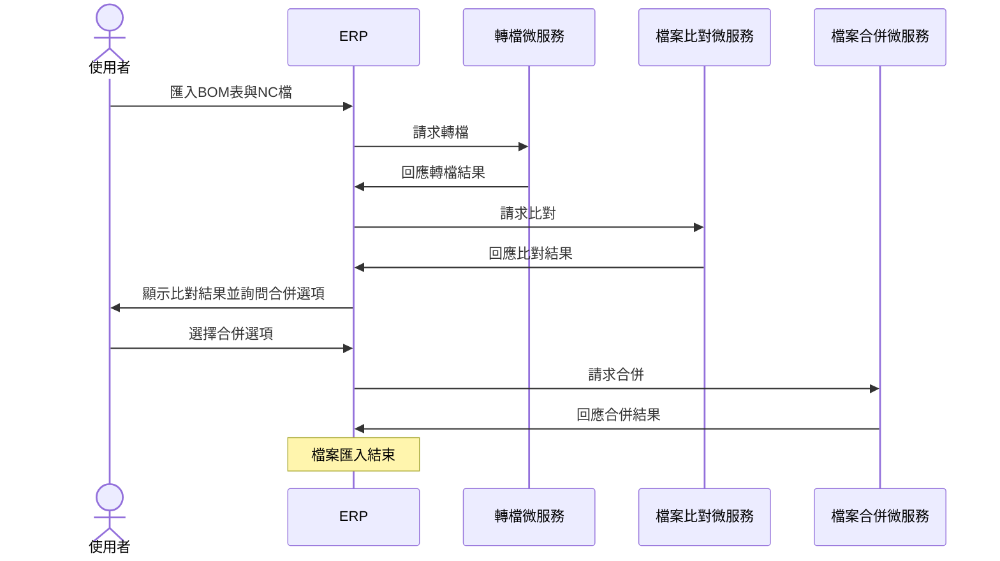

# 流程

## 🔥 BOM 表與 NC 檔匯入流程

```mermaid
sequenceDiagram
  actor 使用者

  使用者 ->> ERP: 匯入BOM表與NC檔

  ERP ->> 轉檔微服務: 請求轉檔
  轉檔微服務 ->> ERP: 回應轉檔結果

  ERP ->> 檔案比對微服務: 請求比對
  檔案比對微服務 ->> ERP: 回應比對結果

  ERP ->> 使用者: 顯示比對結果並詢問合併選項
  使用者 ->> ERP: 選擇合併選項

  ERP ->> 檔案合併微服務: 請求合併
  檔案合併微服務 ->> ERP: 回應合併結果

  Note over ERP: 檔案匯入結束
```
