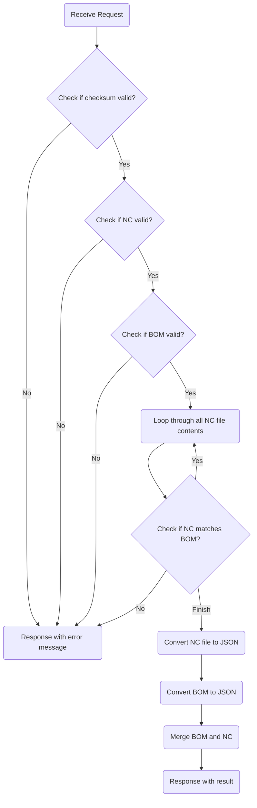

# 轉檔 CLI v1.0.0

## 🔥 用途

作為轉檔的本地服務，將來自 Tekla 的 Bom 表與 NC 檔的資料，轉換成相對應的格式。

## 🔥 版本

| 版本號 | 內容 |
| ------ | ---- |
| v1.0.0 |      |

## 🔥 Road Map

- 加入 Metrics、Logs、Metrics
- 加入其他接頭

## 🔥 CLI 文件

### 🔶 Usage Sample

```sh
$ import-nc-bom --bom-file ./bom.csv --nc-dir ./nc --output-dir ./output
```

### 🔶 Response Sample

```json
{
  "assemblyTemplates": [
    {
      "name": "string",
      "partTemplates": [
        {
          "name": "string",
          "count": "number"
        }
      ]
    }
  ],
  "partTemplates": [
    {
      "name": "string",
      "specification": "string",
      "length": "number",
      "material": "string",
      "ac": "string?",
      "bo": "string?"
    }
  ],
  "assmeblys": [
    {
      "id": "string",
      "name": "string",
      "parts": [
        {
          "id": "string",
          "name": "string"
        },
        {
          "id": "string",
          "name": "string"
        }
      ]
    }
  ]
}
```

### 🔶 Request Body

| name         | type     | desc            | example       |
| ------------ | -------- | --------------- | ------------- |
| --bom-file   | `string` | BOM 表檔案位置  | `"./bom.csv"` |
| --nc-dir     | `string` | NC 檔資料夾位置 | `"./nc"`      |
| --output-dir | `string` |                 | `"./"`        |

### 🔶 Response Body

| name              | type                 | desc         |
| ----------------- | -------------------- | ------------ |
| assemblyTemplates | `AssmeblyTemplate[]` | 構件樣板陣列 |
| partTemplates     | `PartTemplate[]`     | 零件樣板陣列 |
| assmeblys         | `Assmebly[]`         | 構件陣列     |

### 🔶 AssmeblyTemplate

| name          | type                                   | desc         |
| ------------- | -------------------------------------- | ------------ |
| name          | `string`                               | 構件編號     |
| partTemplates | `Array<{name: string; count: number}>` | 零件樣板陣列 |

### 🔶 PartTemplate

| name          | type      | desc       |
| ------------- | --------- | ---------- |
| name          | `string`  | 零件編號   |
| specification | `string`  | 斷面規格   |
| length        | `number`  | 長度       |
| material      | `string`  | 材質       |
| ac            | `string?` | 外輪廓描述 |
| bo            | `string?` | 孔群描述   |

### 🔶 Assmebly

| name  | type     | desc     |
| ----- | -------- | -------- |
| id    | `string` | GUID     |
| name  | `string` | 構件編號 |
| parts | `Part[]` | 零件陣列 |

### 🔶 Part

| name | type     | desc     |
| ---- | -------- | -------- |
| id   | `string` | GUID     |
| name | `string` | 零件編號 |

## 🔥 Api Flow


